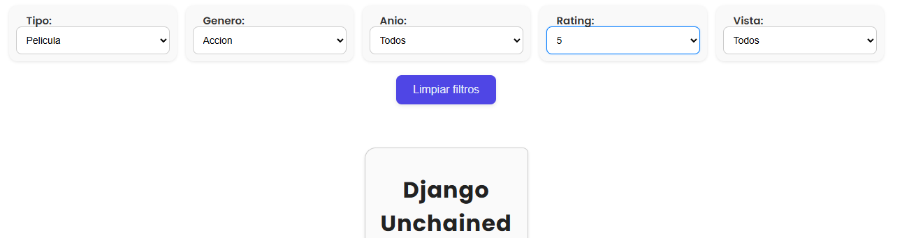

Correcciones:

- Muy lindo readme.
- Muy linda UI. Se nota que se esforzaron en el css
- Tremendo hook el usePelis. Les quedo muy bien.
- Excelente uso de componentes y organizacion del proyecto.
- Codigo limpio, facil de entender.

Observaciones:
- Borren archivos de imagenes que se generan por default antes de entregar.
- Borren codigo comentado y logs antes de entregar.
- No entregaron las respuestas a las preguntas teorias :(


Nota: 9


```
                        .="=.
                      _/.-.-.\_     _
                     ( ( o o ) )    ))
                      |/  "  \|    //
      .-------.        \'---'/    //
     _|hello  |_       /`"""`\\  ((
   =(_|_______|_)=    / /_,_\ \\  \\
     |:::::::::|      \_\\_'__/ \  ))
     |:::::::[]|       /`  /`~\  |//
     |o=======.|      /   /    \  /
jgs  `"""""""""`  ,--`,--'\/\    /
                   '-- "--'  '--'

```

#

# Trabajo Práctico N°1 - React - Grupo 12 

### Podés ver la página acá:
- [TP-1](https://tp-react-pwa-h3cr.vercel.app/)

### Integrantes

- [Pacheco Leonardo](https://github.com/pachecoleoo): **UX Lead**
- [Pilchuman Esteban](https://github.com/Esteban0010): **Frontend Dev**
- [Villablanca Rodrigo](https://github.com/shodrig0): **Backend Dev**

## Descripción

### Dominio: Watchlist - Gestor de Películas y Series

Esta aplicación web desarrollada con **React** funciona como un gestor personal de películas y series, permitiendo al usuario organizar el contenido que desea ver y el que ya ha visto.

### Funcionalidades principales

- Agregar, editar y eliminar películas o series
- Marcar contenido como _visto_ o _no vistas_
- Visualización en listas separadas: _no vistas_ y _vistas_
- Filtros por **género** y **tipo** (película o serie) de manera dinámica
- Búsqueda por **título** o **director**
- Ordenamiento por **año** y **rating**, ascendente o descendente
- Contadores totales por **lista** y por **género**
- Mensajes informativos cuando no hay ítems o no se encuentran resultados
- Persistencia de datos usando ```localStorage```

## Previsualización
#### Visión general:


#### Formulario de carga en una modal:


#### Contenido cargado en cards:


#### Filtro mostrando las _vistas_:


#### Algunos filtros que coinciden con la búsqueda:


#### Mensaje de error:


#### Contador:


## Instalación

1. Clonar este repositorio con ```git clone```
2. Ingresar con el comando ```cd **nombre de carpeta**```
3. Ejecutar ```npm i``` o ```npm install``` para instalar node_modules
4. Correr la aplicación utilizando ```npm run dev```

## Tecnologías
- [HTML+CSS](https://www.w3.org/Style/Examples/011/firstcss.es.html)
- [Nodejs](https://nodejs.org/en)
- [React](https://react.dev/)
- [vite](https://vite.dev/)

#

```
 __                 
'. \                       See you, bye bye!
 '- \               
  / /_         .---.
 / | \\,.\/--.//    )
 |  \//        )/  / 
  \  ' ^ ^    /    )____.----..  6
   '.____.    .___/            \._) 
      .\/.                      )
       '\                       /
       _/ \/    ).        )    (
      /#  .!    |        /\    /
      \  C// #  /'-----''/ #  / 
   .   'C/ |    |    |   |    |mrf  ,
   \), .. .'OOO-'. ..'OOO'OOO-'. ..\(,
   ```